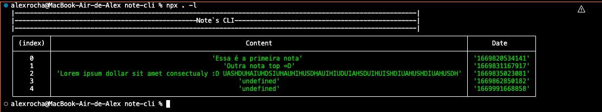

## Note CLI


### Pacote de execução npx para salvar notas do dia-a-dia.

--------

Note CLI é um utilitário de linha de comando para salvar notas de texto que podem ser consultadas na própria linha de comando. A idéia é criar uma lista de consulta rápida dentro do terminal para consulta

O utilitário é construído utilizando node.Js e npx, onde o mesmo será executa via linha de comando pelo comando 

```sh
 npx note 
 ```
Saída:

 ```sh
Necessário informar opção de execucão/n Ex: --add | -a | -l | --list 5
 ```

Para adicionar uma nova nota:

```sh
 npx note --add='Nova nota' 
 ```
Saída:
```sh
(1) nova nota adicionada.
```

Para listar as notas armazenadas:

```sh
 npx note --list 
 ```
 ou
```sh
 npx note -l 
 ```

Saída:




